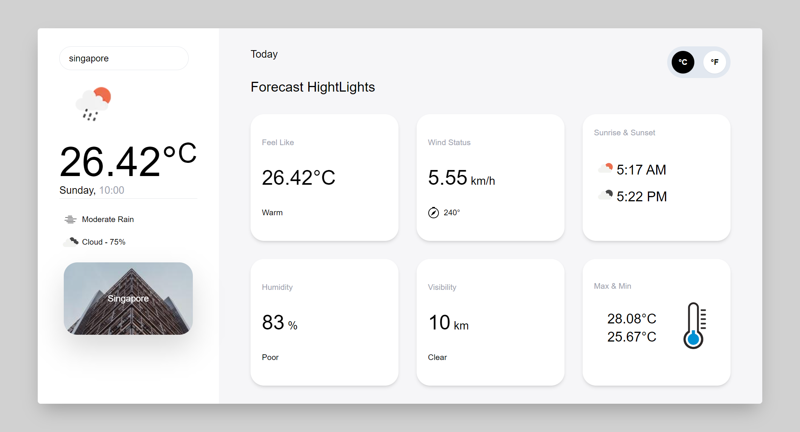

## Weather website

### Next js project

### In This Projects I use

- Next JS
- TypeScript
- Tailwind
- Framer-motion
- Openweather Map API

> [Reference UI](https://dribbble.com/shots/10460680-Weather-App?utm_source=Clipboard_Shot&utm_campaign=mikhaltsov23&utm_content=Weather%20App&utm_medium=Social_Share&utm_source=Clipboard_Shot&utm_campaign=mikhaltsov23&utm_content=Weather%20App&utm_medium=Social_Share&utm_source=Clipboard_Shot&utm_campaign=mikhaltsov23&utm_content=Weather%20App&utm_medium=Social_Share&utm_source=Clipboard_Shot&utm_campaign=mikhaltsov23&utm_content=Weather%20App&utm_medium=Social_Share)

### Website UI

